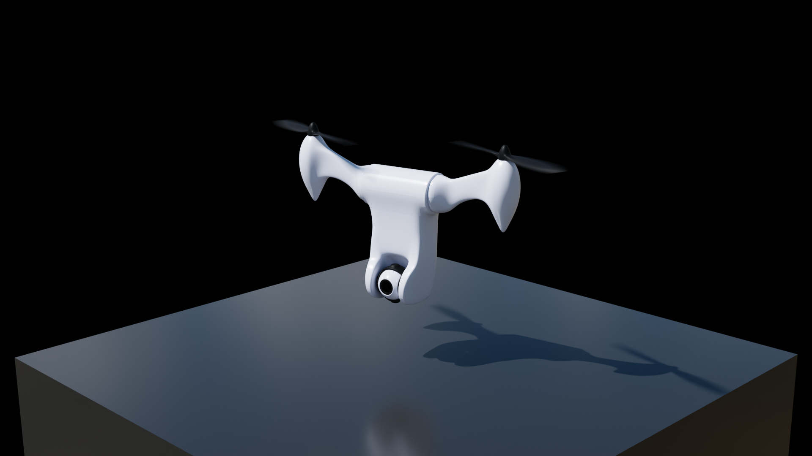

# Bicopter Attitude Control (Simulink) — Modeling → Linearization → Controllers → Validation

This project implements and studies **attitude control** (roll φ, pitch θ, yaw ψ) for a two-rotor **bicopter**.  
Workflow: build a **nonlinear plant**, extract **linear models** around hover, design **Lead** and **PID** controllers to hit target specs, then validate against **disturbances** and the **original nonlinear** model.

<p align="center">
  
</p>

---

## Highlights
- End-to-end control pipeline: **nonlinear → linear → design → test → back-to-nonlinear**.
- Compare **Lead** vs **PID** under step commands and step **disturbances**.
- Clear separation of **plant**, **controllers**, and **parameters** for easy re-tuning.

---

## Repository layout
```
bicopter-control-sim/
├─ simulink/
│  ├─ nonlinear_model.slx          # Full nonlinear plant (attitude-focused)
│  ├─ linear_models.slx            # Extracted SISO attitude channels (φ, θ, ψ)
│  ├─ lead_controller.slx          # Lead loop with step/disturbance tests
│  ├─ pid_controller.slx           # PID loop with step/disturbance tests
│  └─ utils/params.m               # Mass, inertia, geometry, motor constants
├─ matlab/
│  ├─ linearize_attitude.m         # Gets TF/SS near hover (small angles)
│  ├─ design_lead.m                # Places desired poles, computes (z, p)
│  ├─ tune_pid.m                   # Scripted PID tuning around target specs
│  ├─ run_step_tests.m             # Batch step sims → metrics/plots
│  └─ run_disturbance_tests.m      # Disturbance injections → metrics/plots
├─ docs/
│  └─ figures/                     # Block diagrams, Bode/root locus, responses
├─ README.md
└─ LICENSE
```

> If you only have `.slx` models, keep this structure; the MATLAB scripts can be stubs that call those models.

---

## Quickstart
1) **Open parameters:** edit `simulink/utils/params.m`  
   - `m, Jx, Jy, Jz` (mass & inertias)  
   - `l` (arm length), motor thrust/torque constants  
   - gravity, nominal hover RPM/tilt if used
2) **Nonlinear plant:** open `simulink/nonlinear_model.slx`, run a small-angle hover test.  
3) **Linearize:** run `matlab/linearize_attitude.m` → get TF/SS for φ/θ/ψ around hover.  
4) **Design controllers:**  
   - **Lead:** `matlab/design_lead.m` (choose Tr/%OS → pick target poles → compute zero/pole).  
   - **PID:** `matlab/tune_pid.m` (target e.g., Tr ≈ 0.5 s, %OS ≈ 10–20%).  
5) **Evaluate:**  
   - `matlab/run_step_tests.m` → step responses & metrics (rise, overshoot, settling, ESS).  
   - `matlab/run_disturbance_tests.m` → step disturbance at plant input / summed input.  
6) **Back to nonlinear:** swap plant block in `lead_controller.slx` / `pid_controller.slx` with the **nonlinear** model and re-run.

---

## Modeling notes (attitude focus)
- States: [φ, θ, ψ, p, q, r] with standard **Euler-rate ↔ body-rate** mappings.
- Inputs: motor pair effects (thrust/torque/tilt) mapped via a **mixer** to attitude torques.
- Hover trim: small angles near zero, thrust balances weight; use this as the linearization point.

---

## Controller designs

### Lead compensator
- Form: \( C_{\text{lead}}(s) = \dfrac{s + z}{s + p} \) with \( p > z \) for phase lead.
- Use `design_lead.m` to pick \( z, p \) to meet your target poles (from Tr/%OS).
- **Pros:** clean, low overshoot, simple.  
- **Cons:** type-0 → **nonzero steady-state error** to step disturbances.

### PID (or PI/PIDF)
- Use `tune_pid.m` to reach Tr/%OS targets; start with PI for zero ESS to step disturbances, add D for speed if needed.
- **Pros:** can remove steady-state error (integral action).  
- **Trade-off:** higher overshoot/sensitivity unless tuned carefully (derivative filtering helps).

---

## Experiments

### 1) Step commands (linear plant)
- Compare Lead vs PID on φ/θ/ψ channels.  
- Record: **Tr**, **%OS**, **Ts**, **ESS**.  
- Inspect root locus/Bode after each design change.

### 2) Step disturbances
- Inject a step **at plant input** (torque bias) and **as summed input** (before controller) — both are informative.  
- Lead will show nonzero ESS; PI/PID should reject to zero (within limits).

### 3) Back-to-nonlinear validation
- Replace linear plant with **nonlinear_model** and re-run the exact tests.  
- Expect some mismatch (coupling, saturation, tilt/actuator limits). Re-tune if needed, or consider **gain scheduling**.

---

## Results summary (typical expectations)
- **Lead:** very low overshoot, slower closed-loop feel; steady-state error under step disturbance.  
- **PID:** faster responses with target Tr (e.g., ~0.5 s) and ~10–20% overshoot; rejects step disturbances to ~0 ESS.  
- Back-to-nonlinear: small discrepancies; aggressive commands may show coupling/saturation effects. Add **anti-windup**, include **mixer limits**, or move to **LQR/LQG** for coupled axes.

---

## Recreate figures
Run:
```matlab
matlab/linearize_attitude.m
matlab/design_lead.m
matlab/tune_pid.m
matlab/run_step_tests.m
matlab/run_disturbance_tests.m
```
Generated plots land in `docs/figures/`: step responses (open/closed), Bode, root locus, disturbance responses.

---

## Known limitations / next steps
- Current lead design is **type-0** → nonzero ESS to step disturbances. Add **integral** (lead-lag or PI/PID).  
- Axes tuned independently; for stronger coupling, move to **MIMO** (LQR/LQG) or **gain-scheduled** control.  
- Add **actuator/motor** dynamics, **saturation**, and **anti-windup** for realism.  
- Identify a proper trim and re-linearize for larger envelopes; consider **LPV** or **scheduled** gains.

---

## License
- **Models & scripts:** MIT  
- **Figures/report excerpts:** CC-BY-4.0

## Citation
```
@software{bicopter_control_sim_2025,
  author = {Arash Ganjei},
  title  = {Bicopter Attitude Control — Modeling, Linearization, and Simulation (Simulink)},
  year   = {2025},
  url    = {https://github.com/<your-username>/bicopter-control-sim}
}
```
